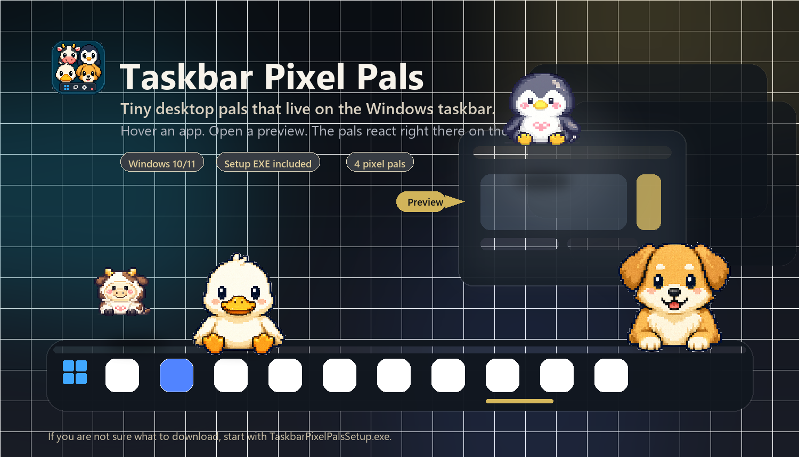
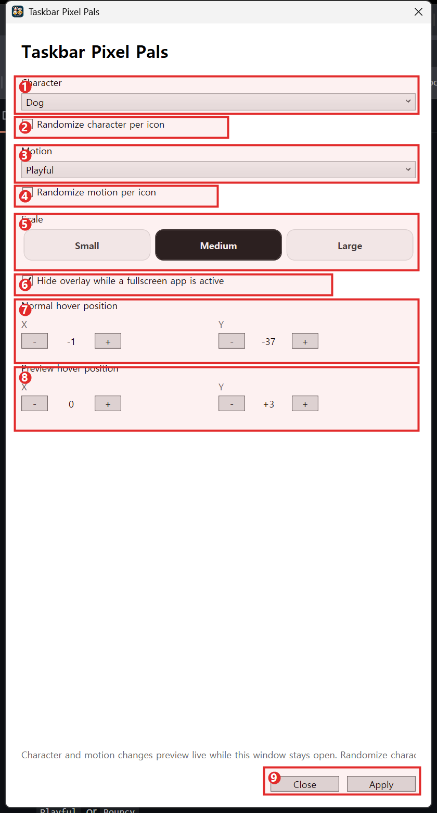

# Taskbar Pixel Pals

  English | <a href="./README.ko.md">한국어</a>

Taskbar Pixel Pals is a small Windows desktop companion that places animated pixel animals on your taskbar.

It is built for a light, playful desktop feel without turning into a full widget platform.

  

## Links

- Product page: [firbe-labs.netlify.app/products/taskbar-pixel-pals](https://firbe-labs.netlify.app/products/taskbar-pixel-pals/)
- Latest release: [GitHub Releases](https://github.com/firstnbest824-beep/taskbar-pixel-pals/releases/latest)

## What It Does

Taskbar Pixel Pals watches taskbar hover and preview states, then places a tiny animated character so it feels like the character is reacting to your desktop.

Current MVP includes:

- 4 characters: `Cow`, `Penguin`, `Duck`, `Dog`
- 3 motion profiles: `Calm`, `Playful`, `Bouncy`
- 3 size presets: `Small`, `Medium`, `Large`
- Hover position adjustment
- Preview hover position adjustment
- Randomize character per icon
- Randomize motion per icon
- Fullscreen suppression option
- Local settings persistence

## Download

> If you are not sure which file to download, start with `TaskbarPixelPalsSetup.exe`.

The latest release includes three download options.

| File | Recommended for | Notes |
| --- | --- | --- |
| `TaskbarPixelPalsSetup.exe` | Most users | Recommended. This is the normal installer most people should download. |
| `TaskbarPixelPals.U2OverlaySpike.exe` | Portable use | Standalone executable with no installer. |
| `taskbar-pixel-pals-windows-x64.zip` | Manual extraction | ZIP version of the portable build. |

## Installation

### Recommended: Setup EXE

1. Open the [latest release page](https://github.com/firstnbest824-beep/taskbar-pixel-pals/releases/latest).
2. Download `TaskbarPixelPalsSetup.exe`.
3. Run the installer.
4. Launch `Taskbar Pixel Pals` from the Start menu after install.

The current installer:

- installs to your local app directory
- can create a desktop shortcut
- creates an uninstall entry
- can launch the app right after installation

### Portable EXE

If you do not want installation:

1. Download `TaskbarPixelPals.U2OverlaySpike.exe` from the latest release.
2. Place it anywhere you want.
3. Run it directly.

### ZIP Build

If you prefer a packaged portable build:

1. Download `taskbar-pixel-pals-windows-x64.zip`.
2. Extract it.
3. Run the executable inside the extracted folder.

## First Run

On first run, Windows may show a SmartScreen warning because this is an indie desktop app.

If that happens:

1. Click `More info`
2. Click `Run anyway`

## How To Use

### 1. Launch the app

Start Taskbar Pixel Pals.

The app opens a settings window and starts the overlay behavior.

The settings window is the main control UI for the app.

### UI Control Guide

  

1. `Character`
   Choose the default pal you want to use: `Cow`, `Penguin`, `Duck`, or `Dog`.
2. `Randomize character per icon`
   Turn this on if you want different taskbar apps to get different characters automatically.
3. `Motion`
   Choose the default movement style: `Calm`, `Playful`, or `Bouncy`.
4. `Randomize motion per icon`
   Turn this on if you want the motion style to vary by taskbar app.
5. `Scale`
   Change the overall overlay size with `Small`, `Medium`, or `Large`.
6. `Hide overlay while a fullscreen app is active`
   Keep this on if you want the pal to disappear during games, video playback, or fullscreen work.
7. `Normal hover position`
   Fine-tune where the character appears when you hover a regular taskbar icon before any preview thumbnail opens.
8. `Preview hover position`
   Fine-tune where the character sits when the Windows preview thumbnail is open and the character is perched against that preview.
9. `Close / Apply`
   `Apply` saves the current settings and minimizes the settings window. `Close` exits the app.

Position control notes:

- `Normal hover position` is for the default icon-hover state.
- `Preview hover position` is for the thumbnail-preview perched state.
- `X` moves left or right.
- `Y` moves vertically.
- In the current UI, negative `Y` values move the character downward and positive `Y` values move it upward.

### 2. Choose a character

You can pick one fixed character:

- `Cow`
- `Penguin`
- `Duck`
- `Dog`

Or enable random character selection per taskbar icon.

### 3. Choose a motion profile

You can tune the behavior style with:

- `Calm`
- `Playful`
- `Bouncy`

Or enable random motion selection per icon.

### 4. Choose a size

Available scale presets are:

- `Small` -> `112`
- `Medium` -> `128`
- `Large` -> `160`

### 5. Adjust taskbar alignment if needed

Depending on display scale, taskbar layout, preview shape, and system setup, the character may need a small manual position correction.

You can adjust:

- `Hover position X/Y`
- `Preview hover position X/Y`

What each mode means:

- `Normal hover position`
  This controls where the character appears when you hover a normal taskbar icon and no preview thumbnail is open yet.
- `Preview hover position`
  This controls where the character sits when the Windows preview thumbnail pops up and the character perches against that preview.

Adjustment notes:

- `X` moves the character left or right.
- `Y` moves the character vertically.
- In the current UI, negative `Y` values move the character downward and positive `Y` values move it upward.
- If the perched pose looks slightly too low or too high, adjust `Preview hover position` instead of `Normal hover position`.

### 6. Fullscreen suppression

If enabled, the overlay hides itself while fullscreen content is active.

This is useful when you do not want the character to appear during games, video playback, or fullscreen work.

### 7. Apply your settings

Click `Apply` to save the current configuration.

The current build saves settings locally and minimizes the settings window after applying.

## Where Settings Are Stored

Taskbar Pixel Pals stores settings locally at:

`%LOCALAPPDATA%\FirbeLabs\TaskbarPixelPals\settings.json`

## Privacy

Taskbar Pixel Pals works locally on your machine.

- No sign-in
- No account
- No cloud sync
- No upload of desktop content

It uses taskbar hover and preview state only to place the overlay correctly.

## Current Status

This is the first public MVP release.

The current focus is:

- character feel
- perched preview placement
- lightweight desktop utility behavior
- quick local customization

## Troubleshooting

### The character feels slightly too high or too low

Use `Hover position Y` or `Preview hover position Y` in settings until it lines up better with your taskbar.

### The preview pose looks slightly off for your system

Use `Preview hover position X/Y` to fine-tune the perched alignment on the preview thumbnail.

### I am not sure whether to change Normal hover or Preview hover

Use:

- `Normal hover position` for the default icon-hover state
- `Preview hover position` for the thumbnail-preview perched state

### Nothing appears while a fullscreen app is open

Check whether `Fullscreen suppression` is enabled.

## Firbe Labs

Taskbar Pixel Pals is made by [Firbe Labs](https://firbe-labs.netlify.app/).

For updates and release notes:

- [Product page](https://firbe-labs.netlify.app/products/taskbar-pixel-pals/)
- [Releases](https://github.com/firstnbest824-beep/taskbar-pixel-pals/releases)
